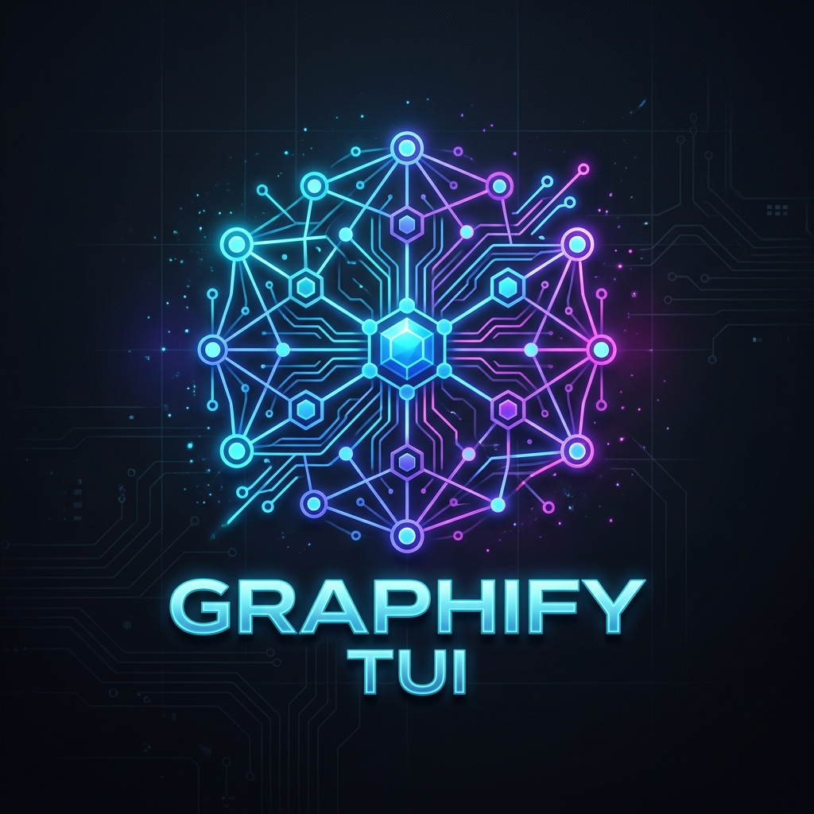

<p align="center">
  
</p>

<h1 align="center">Graphify TUI</h1>

<p align="center">
  
  
  
  
  
  
  
</p>


---

## ⚡ Overview

**Graphify TUI** is a premium, interactive terminal-based developer console and codebase visualization browser built in **Rust** using the [Ratatui](https://ratatui.rs/) framework. It empowers developers to explore codebase structure, traverse AST relationships (definitions, call graphs, imports), and perform local AI-assisted code refinements and annotations on the fly.

By integrating directly with **Ollama** and the **OpenClaw** autonomous agent framework, Graphify TUI brings code navigation and agentic software refinement directly to your terminal window.

---

## ✨ Features

- 🧭 **Graph-Node Traversal**: Recursively walk through files, classes, and function nodes via call graphs, imports, and definitions directly in the console.
- 🤖 **Double AI Engines**:
  - **Ollama**: Connects to locally hosted lightweight LLMs (like `gemma2`) for high-speed, offline operations.
  - **OpenClaw**: Harnesses the power of the OpenClaw autonomous agent framework to handle multi-step software refinements.
- 📝 **Auto-Annotation**: Generate clean docstrings and inline comments for any selected node with a single keystroke (`a`).
- 🛠️ **Iterative Refinement**: Refactor or optimize selected symbols interactively via prompt instructions (`r`).
- 🔍 **Fuzzy Search**: Instantly filter and search codebase symbols (`/`).
- 📂 **AST Codebase Re-scanning**: Refresh your AST codebase map recursively on demand (`s`).

---

## 🚀 Quick Start

### 1. Prerequisites
Ensure you have the following installed:
- [Rust & Cargo](https://rustup.rs/) (v1.70+)
- [Ollama](https://ollama.com/) (running locally)
- [OpenClaw](https://openclaw.ai/) CLI (installed and running)

### 2. Compilation
Compile the project in release or debug mode:
```bash
# Clone the repository
git clone <repository_url>
cd graphify-tui

# Build the binary
cargo build --release
```

### 3. Usage
Run the compiled binary by passing the target codebase path as an argument:
```bash
./target/release/graphify-tui /path/to/your/codebase
```

---

## ⌨️ Key Bindings

| Key | Action |
| --- | --- |
| `Tab` | Switch focus between lists (Symbols vs. Edges) |
| `Up` / `Down` | Navigate lists |
| `Enter` | Follow the selected traversal link (neighbor node) |
| `Esc` | Backtrack graph navigation history |
| `b` | Toggle AI backend (**Ollama** vs. **OpenClaw**) |
| `a` | Generate comments/docstrings for the selected symbol |
| `r` | Prompt for iterative code refinement |
| `/` | Filter codebase symbols |
| `s` | Re-scan codebase using AST extractor |
| `q` | Quit application |

---

## 📁 Housekeeping

- **License**: Released under the [MIT License](LICENSE).
- **Contributing**: Contributions are welcome! See [CONTRIBUTING.md](CONTRIBUTING.md) for details.
